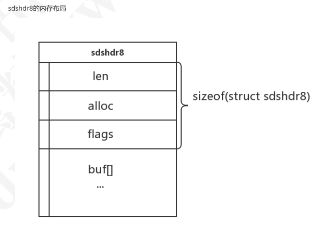
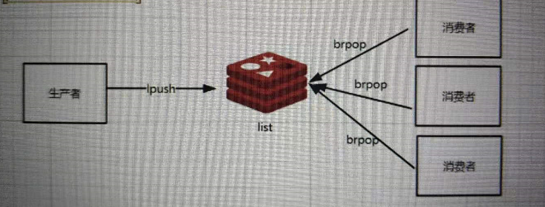

# 01-redis基础


> redis安装、redis的五种数据结构及常用命令(字符串类型、hash类型、集合类型、有序集合类型、列表类型)、key的设计技巧、redis的事务处理机制、redis发布订阅模式、redis客户端jedis的使用及实践

#### 数据类型

##### 字符类型

###### 使用场景

- session复制

- IP限制 （incr）

  > 短信验证

###### 注意事项

namespace规范

sms:limit:mobile


###### 最大限制与数据存储

>  字符串类型是redis中最基本的数据类型，它能存储任何形式的字符串，包括二进制数据。你可以用它存储用户的邮箱、json化的对象甚至是图片。一个字符类型键允许存储的最大容量是512M

###### 内部数据结构

> 在Redis内部，String类型通过 **int、SDS**(simple dynamic string)作为结构存储，int用来存放整型数据，sds存放字节/字符串和浮点型数据。

> redis3.2分支引入了五种sdshdr类型，目的是为了满足不同长度字符串可以使用不同大小的Header，从而节省内存，每次在创建一个sds时根据sds的实际长度判断应该选择什么类型的sdshdr，不同类型的sdshdr占用的内存空间不同。这样细分一下可以省去很多不必要的内存开销

```c
//redis会根据字符串的长度来判断使用哪个sdshdr
struct __attribute__ ((__packed__)) sdshdr5{}//sdshdr5没有用到
struct __attribute__ ((__packed__)) sdshdr8{}
struct __attribute__ ((__packed__)) sdshdr16{}
struct __attribute__ ((__packed__)) sdshdr32{}
struct __attribute__ ((__packed__)) sdshdr64{}

typedef char *sds;

struct __attribute__ ((__packed__)) sdshdr8 //8表示字符串最大长度是2^8-1 （长度为255）
{ 
 uint8_t len;//表示当前sds的长度(单位是字节)  
 uint8_t alloc; //表示已为sds分配的内存大小(单位是字节)  
 unsigned char flags; 
 //用一个字节表示当前sdshdr的类型，因为有sdshdr有五种类型，所以至少需要3位来表示000:sdshdr5，001:sdshdr8，010:sdshdr16，011:sdshdr32，100:sdshdr64。高5位用不到所以都为0。  
char buf[];//sds实际存放的位置``};
```



###### 赋值

SET key  value

###### 存在返回，不存在赋值

setnx key value

###### 取值

GET key

###### 递增数字1

incr key

###### 错误递增数字演示

int value= get key;

value =value +1;

set key value;

###### **递增指定的整数**

incryby key increment

###### 原子递减

decr key

###### 向指定的key追加字符串

append key value

###### 获得key对应的value的长度

strlen key

###### 同时获得多个key的value

mgetkey key..

###### 同时设置多个key，value

mset key value  key value key value …


##### 列表类型

###### 使用场景


- 生产者 / 消费者



- 栈

- 队列

  


###### 内部数据结构

> redis3.2之前，List类型的value对象内部以linkedlist或者ziplist来实现, 当list的元素个数和单个元素的长度比较小的时候，Redis会采用ziplist（压缩列表）来实现来减少内存占用。否则就会采用linkedlist（双向链表）结构。

> redis3.2之后，采用的一种叫quicklist的数据结构来存储list，列表的底层都由quicklist实现。

> 这两种存储方式都有优缺点
>
> 双向链表在链表两端进行push和pop操作，在插入节点上复杂度比较低，但是内存开销比较大； 
>
> ziplist存储在一段连续的内存上，所以存储效率很高，但是插入和删除都需要频繁申请和释放内存；

> quicklist仍然是一个双向链表，只是列表的每个节点都是一个ziplist，其实就是linkedlist和ziplist的结合，quicklist中每个节点ziplist都能够存储多个数据元素


###### 概念

> list,可以存储一个有序的字符串列表,常用的操作是向列表两端添加元素或者获得列表的某一个片段。

###### 从左边push数据

LPUSH key value value …

###### 从右边push数据

RPUSH key value value …

###### 从左边移除并且返回数据

LPOP key

###### 从右边移除并且返回数据

RPOP key

######  获得列表的长度

llen num 

###### 按照指定范围取值

lrangekey  startIndex stopIndex  

>  索引从零开始
>
> 索引可以是负数， -1表示最右边的第一个元素

###### 删除指定个数value

lrem key count value

###### 设置value到指定位置

lset key index value

###### 应用场景

> 可以用来做分布式消息队列

##### 散列类型

###### 应用场景

> 比较适合存储对象

###### 设置hash值

hset key field value

###### 获取hash值

hget key filed 

###### 一次性设置多个值

hmset key filed value [filed value …]

###### 一次性获得多个值

hmget key field field …

###### 获得hash的所有信息

hgetall key

###### 判断字段是否存在

hexists key field

> 存在返回1.不存在返回0

###### 字段递增

hincryby key filed

###### 判断key field是否存在

hsetnx key filed

###### 删除一个或者多个字段

hdel key field [field …]

##### 集合类型

###### set/list的比较

>  set跟list不一样的点。集合类型不能存在重复的数据。而且是无序的

###### 增加数据

sadd key member [member ...]

> 如果value已经存在，则会忽略存在的值，并且返回成功加入的元素的数量

###### 删除元素

srem key member  

###### 获得所有数据

smembers key

######  对多个集合执行差集运算

sdiffkey key …

###### 对多个集合执行并集操作

sunion key

> 同时存在在两个集合里的所有值

##### 有序集合

###### 添加到有序集合

zadd key score member

###### 获得元素

zrange key start stop [withscores]  

> withscores是可以获得元素的分数

> 如果两个元素的score是相同的话，那么根据(0<9<A<Z<a<z) 方式从小到大

#### 功能

- 可以为每个key设置超时时间；

- 可以通过列表类型来实现分布式队列的操作

- 支持发布订阅的消息模式

#### 简单

- 提供了很多命令与redis进行交互

#### redis的应用场景

- 数据缓存（商品数据、新闻、热点数据）

- 单点登录

- 秒杀、抢购

- 网站访问排名…

- 应用的模块开发


#### redis的安装

1. 下载redis安装包 
2.  tar -zxvf 安装包
3. 在redis目录下 执行 make
4. 可以通过make test测试编译状态
5. make install [prefix=/path]完成安装


#### 启动停止连接redis

##### 启动

./redis-server ../redis.conf

##### 停止

./redis-cli shutdown

##### 后台运行

以后台进程的方式启动，修改redis.conf   daemonize =yes

##### 连接

./redis-cli -h 127.0.0.1 -p 6379

#### 其他命令说明

##### 启动服务

Redis-server 

##### 访问到redis的控制台

Redis-cli 

##### 性能测试的工具

redis-benchmark 

##### aof文件进行检测的工具

redis-check-aof 

##### rdb文件检查工具

redis-check-dump  

##### sentinel 服务器配置

redis-sentinel 


#### 多数据支持

默认支持16个数据库；可以理解为一个命名空间

跟关系型数据库不一样的点

1. redis不支持自定义数据库名词
2. 每个数据库不能单独设置授权
3. 每个数据库之间并不是完全隔离的。 可以通过flushall命令清空redis实例面的所有数据库中的数据

>  通过 select dbid去选择不同的数据库命名空间 。 dbid的取值范围默认是0-15

#### 全局命令

-  获得一个符合匹配规则的键名列表

> keys pattern  [?  * []]

- 判断一个键是否存在

  > EXISTS key 

- 获得key的数据结构类型

> type key

#### **key**的设计

> 对象类型:对象id:对象属性:对象子属性

##### 短信重发机制

sms:limit:mobile13888888888  expire 60 

#### redis的事务处理

##### 开启事务

MULTI

##### 执行事务

EXEC


#### 发布订阅

publish channel message

> publish channel_name  message

> publish queue hello

subscribe channel [ …]

> subscribe queue

#### redis实现分布式锁

##### 数据库

##### activemq

##### 缓存

> -redis setnx

##### zookeeper


#### redis分片策略

> codis 
>
> twmproxy