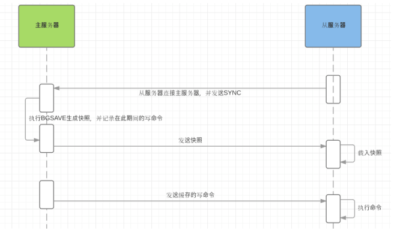
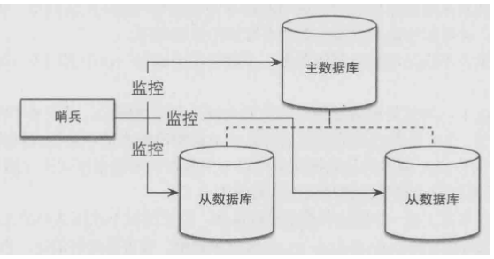
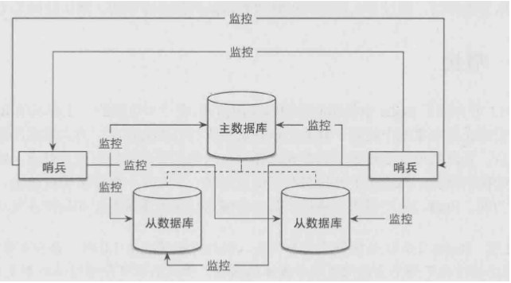

## 集群

> 虽然redis有持久化功能能够保障redis服务器宕机也能恢复并且只有少量的数据损失，但是由于所有数据在一台服务器上，如果这台服务器出现硬盘故障，那就算是有备份也仍然不可避免数据丢失的问题。
> 在实际生产环境中，我们不可能只使用一台redis服务器作为我们的缓存服务器，必须要多台实现集群，避免出现单点故障；

## 主从复制

> 复制的作用是把redis的数据库复制多个副本部署在不同的服务器上，如果其中一台服务器出现故障，也能**快速迁移**到其他服务器上提供服务。 复制功能可以实现当一台redis服务器的数据更新后，自动将新的**数据同步**到其他服务器上主从复制就是我们常见的master/slave模式， 主数据库可以进行读写操作，当写操作导致数据发生变化时会自动将数据同步给从数据库。而一般情况下，**从数据库是只读**的，并接收主数据库同步过来的数据。 **一个主**数据库可以有**多个从**数据库


#### 配置

在redis中配置master/slave是非常容易的，只需要在从数据库的配置文件中加入slaveof 主数据库地址 端口。 而master 数据库不需要做任何改变

```java
准备两台服务器，分别安装redis ， server1 server2
1.  在server2的redis.conf文件中增加 slaveof server1-ip 6379 、 同时将bindip注释掉，允许所
有ip访问
2. 启动server2
3. 访问server2的redis客户端，输入 INFO replication
4. 通过在master机器上输入命令，比如set foo bar 、 在slave服务器就能看到该值已经同步过来了
```


#### 原理

##### 全量复制

Redis全量复制一般发生在**Slave初始化阶段**，这时Slave需要将Master上的所有数据都复制一份。具体步骤



min-slaves-to-write 3 表示只有当3个或以上的slave连接到master，master才是可写的
min-slaves-max-lag 10 表示允许slave最长失去连接的时间，如果10秒还没收到slave的响应，则master认为该
slave以断开

##### 增量复制

> 从redis 2.8开始，就支持主从复制的断点续传，如果主从复制过程中，网络连接断掉了，那么可以接着上次复制的地方，继续复制下去，而不是从头开始复制一份master node会在内存中创建一个**backlog**，master和slave都会保存一个replica **offset**还有一个master id，offset就是保存在backlog中的。如果master和slave网络连接断掉了，slave会让master从上次的replica offset开始继续复制但是如果没有找到对应的offset，那么就会执行一次全量同步

##### 无硬盘复制

> 前面我们说过，Redis复制的工作原理基于RDB方式的持久化实现的，也就是master在后台保存RDB快照，slave接
> 收到rdb文件并载入，但是这种方式会存在一些问题
> 1. 当master禁用RDB时，如果执行了复制初始化操作，Redis依然会生成RDB快照，当master下次启动时执行RDB文件的恢复，但是因为复制发生的时间点不确定，所以恢复的数据可能是任何时间点的。就会造成数据出现问题
>
> 2. 当硬盘性能比较慢的情况下（网络硬盘），那初始化复制过程会对性能产生影响因此2.8.18以后的版本，Redis引入了无硬盘复制选项，可以不需要通过RDB文件去同步，直接发送数据，通过以
>    下配置来开启该功能
>    **repl-diskless-sync yes**
>    master在内存中直接创建rdb，然后发送给slave，不会在自己本地落地磁盘了

#### 哨兵机制

> master遇到异常终端后，需要从slave中选举一个新的master继续对外提供服务,redis并没有提供自动master选举功能，而是需要借助一个哨兵来进行监控

##### 什么是哨兵

> 顾名思义，哨兵的作用就是监控Redis系统的运行状况，它的功能包括两个
>
> 1. 监控master和slave是否正常运
> 2. master出现故障时自动将slave数据库升级为master



##### 哨兵集群

> 哨兵的可用性如何解决，在一个一主多从的Redis系统中，可以使用多个哨兵进行监控任务以保证系统足够稳定。此时哨兵不仅会监控master和slave，同时还会互相监控；这种方式称为哨兵集群，哨兵集群需要解决故障发现、和master决策的协商机制问题
>
> 两个哨兵的协商机制：raft机制



